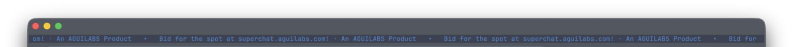

# tmux-superchat

A one-row scrolling **superchat** marquee pinned to the top of every tmux window. It
polls a hosted slot, renders whatever styled message is currently live (bold, italic,
color, rainbow), and shows a house message when the slot is idle.

**For now it also doubles as a live World Cup ticker:** while the 2026 tournament is on,
the marquee interleaves live scores, goal flashes, group standings, and upcoming
fixtures between the messages. There is nothing to set up — the scores ride the same
slot feed; see [World Cup scores](#world-cup-scores).

The client is **read-only and inert**: it fetches the current message over HTTPS and
draws it as plain colored text. It never evaluates anything the server sends.



## Install

**[TPM](https://github.com/tmux-plugins/tpm)** — add to `~/.tmux.conf`, then press `prefix + I`:

```tmux
set -g @plugin 'liberatoaguilar/tmux-superchat'
```

**One-liner** (no TPM):

```bash
curl -fsSL https://superchat.aguilabs.com/install.sh | bash
```

Then add the printed line to `~/.tmux.conf` and reload:

```tmux
run-shell ~/.config/tmux-superchat/superchat.tmux
```

## Requirements

`tmux`, `bash`, `curl`, and `jq` on your `PATH` (standard on macOS/Linux dev boxes).
Without `jq` the marquee still runs but shows a static fallback message instead of the
live slot.

## Configuration

All options are set in `~/.tmux.conf` with `set -g`:

| Option | Default | Meaning |
| --- | --- | --- |
| `@superchat-api` | `https://superchat.aguilabs.com` | API origin the client polls |
| `@superchat-toggle-key` | `a` | toggle key, used as `prefix + <key>` |
| `@superchat-position` | `top` | `top` to enable, `off` to disable registration entirely |
| `@superchat-height` | `1` | marquee height in rows |
| `@superchat-poll-s` | `0.12` | scroll-frame interval (seconds) |
| `@superchat-fetch-s` | `2` | re-fetch interval (seconds) |
| `@superchat-flags` | `auto` | emoji team flags in World Cup items: `auto` (on for macOS, off on Linux where flag glyphs are unreliable), `on`, or `off` |

## World Cup scores

While the 2026 World Cup is on, the marquee doubles as a live scoreboard. Between the
paid and house messages it rotates live scores (with the match minute, or a LIVE badge
for in-progress games), goal flashes (the line briefly inverts the instant a goal
lands), group standings, recent final scores, and upcoming fixtures, roughly three
score items per message.

It rides the same hosted slot feed, so there is nothing to install or enable. Team
names show an emoji flag where one exists; if your terminal renders them poorly, set
`@superchat-flags off` (see the table above). When the tournament ends the ticker goes
quiet and the marquee returns to messages only.

## Keybinding

`prefix + a` toggles the marquee across **all** windows (creates/kills the panes).

## Running alongside other plugins

`tmux-superchat` owns only the **top row** of each window and registers its hooks with
`set-hook -ga` (append), so it coexists with other tmux plugins that own a different
pane region — load order doesn't matter and it won't clobber their hooks.

## Uninstall

```bash
~/.config/tmux-superchat/scripts/uninstall.sh
```

This kills every marquee pane and disables the plugin without disturbing other plugins'
shared hooks. Then remove the `@plugin` / `run-shell` line and reload tmux.

## License

[MIT](./LICENSE) © 2026 Liberato Aguilar Business Software LLC
